# 🎓 Chameleon FCDS - Educational Platform

[](https://chameleon-nu.vercel.app)
[](https://nextjs.org)
[](https://www.typescriptlang.org/)
[](https://supabase.com)

**Chameleon FCDS** is a comprehensive educational platform designed for computer science and data science students at FCDS (Faculty of Computing and Data Sciences). Built with Next.js 14, featuring an interactive quiz system, tournament leaderboards, Google Drive integration, and advanced GSAP animations.

🌐 **Live:** [chameleon-nu.vercel.app](https://chameleon-nu.vercel.app)

---



```mermaid
flowchart TD

subgraph group_app["App routes"]
  node_app_home["Home<br/>route page<br/>[page.tsx]"]
  node_app_journeys["Journeys<br/>route pages"]
  node_app_quiz["Quiz route<br/>dynamic route<br/>[page.tsx]"]
  node_app_drive["Drive route<br/>dynamic route<br/>[page.tsx]"]
  node_app_specialization["Specialization<br/>dynamic route<br/>[page.tsx]"]
  node_app_admin["Admin dashboard<br/>admin page<br/>[page.tsx]"]
end

subgraph group_api["API boundary"]
  node_api_auth["Auth API<br/>auth endpoints"]
  node_api_quiz["Quiz API<br/>quiz endpoints"]
  node_api_drive["Drive API<br/>drive endpoints"]
  node_api_ai["AI API<br/>ai endpoints"]
  node_api_ops["Ops API<br/>system endpoints"]
end

subgraph group_ui["Shared UI"]
  node_ui_shell["UI shell<br/>shared components"]
  node_ui_quiz["Quiz UI<br/>experience components<br/>[quiz-interface.tsx]"]
  node_ui_drive["Drive UI<br/>experience components"]
  node_ui_admin["Admin UI<br/>ops components<br/>[AdminAuthGuard.tsx]"]
end

subgraph group_lib["Core logic"]
  node_lib_auth["Auth core<br/>session/security<br/>[auth.ts]"]
  node_lib_supabase[("Supabase layer<br/>database access")]
  node_lib_integrations["Integrations<br/>external services<br/>[google-oauth.ts]"]
  node_lib_domain["Domain data<br/>quiz/content logic<br/>[department-data.ts]"]
end

subgraph group_content["Content & storage"]
  node_content_quizzes["Quiz assets<br/>static content"]
  node_content_media["Public media<br/>static assets"]
  node_content_supabase["DB bootstrap<br/>migrations and seed"]
end

node_app_home -->|"renders"| node_ui_shell
node_app_journeys -->|"uses"| node_ui_shell
node_app_quiz -->|"renders"| node_ui_quiz
node_app_quiz -->|"loads metadata"| node_lib_domain
node_app_quiz -->|"fetches"| node_api_quiz
node_app_quiz -->|"reads"| node_content_quizzes
node_app_drive -->|"renders"| node_ui_drive
node_app_drive -->|"calls"| node_api_drive
node_app_specialization -->|"uses"| node_lib_domain
node_app_admin -->|"renders"| node_ui_admin
node_app_admin -->|"operates on"| node_api_ops
node_api_auth -->|"enforces"| node_lib_auth
node_api_auth -->|"persists"| node_lib_supabase
node_api_quiz -->|"reads"| node_content_quizzes
node_api_quiz -->|"scores to"| node_lib_supabase
node_api_drive -->|"proxies"| node_lib_integrations
node_api_drive -->|"stores tokens"| node_lib_supabase
node_api_ai -->|"forwards to"| node_lib_integrations
node_api_ops -->|"reads/writes"| node_lib_supabase
node_api_ops -->|"protects"| node_lib_auth
node_ui_shell -->|"uses"| node_content_media
node_lib_supabase -->|"bootstrapped by"| node_content_supabase
node_lib_domain -->|"derives from"| node_content_quizzes
node_lib_integrations -.->|"supports"| node_api_drive

click node_app_home "https://github.com/poz659312-afk/version_3_testing/blob/main/src/app/page.tsx"
click node_app_journeys "https://github.com/poz659312-afk/version_3_testing/tree/main/src/app"
click node_app_quiz "https://github.com/poz659312-afk/version_3_testing/blob/main/src/app/quiz/[department]/[subject]/[quizId]/page.tsx"
click node_app_drive "https://github.com/poz659312-afk/version_3_testing/blob/main/src/app/drive/[driveId]/[...folderPath]/page.tsx"
click node_app_specialization "https://github.com/poz659312-afk/version_3_testing/blob/main/src/app/specialization/[department]/[level]/[subject]/page.tsx"
click node_app_admin "https://github.com/poz659312-afk/version_3_testing/blob/main/src/app/admin/page.tsx"
click node_api_auth "https://github.com/poz659312-afk/version_3_testing/tree/main/src/app/api/auth"
click node_api_quiz "https://github.com/poz659312-afk/version_3_testing/tree/main/src/app/api/quiz"
click node_api_drive "https://github.com/poz659312-afk/version_3_testing/tree/main/src/app/api/google-drive"
click node_api_ai "https://github.com/poz659312-afk/version_3_testing/tree/main/src/app/api/ai"
click node_api_ops "https://github.com/poz659312-afk/version_3_testing/tree/main/src/app/api"
click node_ui_shell "https://github.com/poz659312-afk/version_3_testing/tree/main/src/components"
click node_ui_quiz "https://github.com/poz659312-afk/version_3_testing/blob/main/src/components/quiz-system/quiz-interface.tsx"
click node_ui_drive "https://github.com/poz659312-afk/version_3_testing/blob/main/src/components/GoogleDriveManager.tsx"
click node_ui_admin "https://github.com/poz659312-afk/version_3_testing/blob/main/src/components/AdminAuthGuard.tsx"
click node_lib_auth "https://github.com/poz659312-afk/version_3_testing/blob/main/src/lib/auth.ts"
click node_lib_supabase "https://github.com/poz659312-afk/version_3_testing/tree/main/src/lib/supabase"
click node_lib_integrations "https://github.com/poz659312-afk/version_3_testing/blob/main/src/lib/google-oauth.ts"
click node_lib_domain "https://github.com/poz659312-afk/version_3_testing/blob/main/src/lib/department-data.ts"
click node_content_quizzes "https://github.com/poz659312-afk/version_3_testing/tree/main/public/quizzes"
click node_content_media "https://github.com/poz659312-afk/version_3_testing/tree/main/public"
click node_content_supabase "https://github.com/poz659312-afk/version_3_testing/blob/main/supabase/migrations/20260629_create_quiz_department.sql"

classDef toneNeutral fill:#f8fafc,stroke:#334155,stroke-width:1.5px,color:#0f172a
classDef toneBlue fill:#dbeafe,stroke:#2563eb,stroke-width:1.5px,color:#172554
classDef toneAmber fill:#fef3c7,stroke:#d97706,stroke-width:1.5px,color:#78350f
classDef toneMint fill:#dcfce7,stroke:#16a34a,stroke-width:1.5px,color:#14532d
classDef toneRose fill:#ffe4e6,stroke:#e11d48,stroke-width:1.5px,color:#881337
classDef toneIndigo fill:#e0e7ff,stroke:#4f46e5,stroke-width:1.5px,color:#312e81
classDef toneTeal fill:#ccfbf1,stroke:#0f766e,stroke-width:1.5px,color:#134e4a
class node_app_home,node_app_journeys,node_app_quiz,node_app_drive,node_app_specialization,node_app_admin toneBlue
class node_api_auth,node_api_quiz,node_api_drive,node_api_ai,node_api_ops toneAmber
class node_ui_shell,node_ui_quiz,node_ui_drive,node_ui_admin toneMint
class node_lib_auth,node_lib_supabase,node_lib_integrations,node_lib_domain toneRose
class node_content_quizzes,node_content_media,node_content_supabase toneIndigo

```

## 📋 Table of Contents

- [Features](#-features)
- [Tech Stack](#-tech-stack)
- [Project Structure](#-project-structure)
- [Getting Started](#-getting-started)
- [Core Features](#-core-features)
  - [Quiz System](#-quiz-system)
  - [Tournament System](#-tournament-system)
  - [Specializations](#-specializations)
  - [Google Drive Integration](#-google-drive-integration)
  - [Animations](#-animations)
- [Authentication](#-authentication)
- [Database Schema](#-database-schema)
- [API Endpoints](#-api-endpoints)
- [Deployment](#-deployment)
- [Contributing](#-contributing)
- [License](#-license)

---

## ✨ Features

### 🎯 **Learning Management**
- **6 Specializations**: Computing & Data Sciences, Cybersecurity, AI, Media Analytics, Business Analytics, Healthcare Informatics
- **140+ Quizzes**: Multi-level questions with instant feedback
- **Level System**: Progressive difficulty from Level 1 to advanced levels
- **Personalized Dashboard**: Track progress, scores, and achievements
- **Certifications**: Earn certificates upon course completion

### 🏆 **Tournament System**
- **Real-time Leaderboards**: Separate rankings for Level 1 and Level 2
- **Competitive Scoring**: Points based on speed, mode, and completion
- **Tournament Prizes**: Exclusive rewards and recognition
- **First Attempt Scoring**: Only your first attempt counts (prevents score inflation)
- **Live Rankings**: See your rank among all participants
- **Tournament Period**: October 11, 2025 - January 11, 2026

### 📚 **Quiz Features**
- **Multiple Modes**: Traditional and Instant Feedback
- **Time Options**: 1, 5, 15, 30, 60 minutes, or unlimited
- **Smart Scoring**: Calculated based on duration, mode, and completion
- **Progress Tracking**: Visual progress indicators and statistics
- **Quiz History**: Review past attempts and scores

### 🎨 **Modern UI/UX**
- **GSAP Animations**: Smooth scroll animations, parallax effects
- **Dark Theme**: Eye-friendly dark mode design
- **Responsive Design**: Mobile-first approach
- **Interactive Elements**: Magnetic buttons, floating elements
- **Accessibility**: WCAG 2.1 Level AA compliant

### 📁 **File Management**
- **Google Drive Integration**: Store and manage course materials
- **Automatic Token Refresh**: Seamless authentication
- **Folder Organization**: Department and specialization-based structure
- **Secure URLs**: Time-limited access tokens

### 📊 **Analytics & Insights**
- **Real-time Stats**: Live user enrollment and level distribution
- **Progress Visualization**: Dot plots and charts
- **Performance Metrics**: Track improvement over time
- **Tournament Analytics**: Detailed point breakdowns

---

## 🛠️ Tech Stack

### **Frontend**
- **Framework**: [Next.js 14](https://nextjs.org) (App Router)
- **Language**: [TypeScript](https://www.typescriptlang.org/)
- **Styling**: [Tailwind CSS 4](https://tailwindcss.com)
- **UI Components**: [Radix UI](https://www.radix-ui.com/) + [shadcn/ui](https://ui.shadcn.com/)
- **Animations**: [GSAP 3](https://greensock.com/gsap/) + [Framer Motion](https://www.framer.com/motion/)
- **Icons**: [Lucide React](https://lucide.dev/)
- **Forms**: [React Hook Form](https://react-hook-form.com/) + [Zod](https://zod.dev/)

### **Backend**
- **Runtime**: Node.js
- **API Routes**: Next.js API Routes (Serverless)
- **Database**: [Supabase](https://supabase.com) (PostgreSQL)
- **Authentication**: Custom Auth + Supabase
- **File Storage**: Google Drive API
- **Cron Jobs**: [cron-job.org](https://cron-job.org)

### **External Services**
- **OAuth**: Google OAuth 2.0
- **APIs**: Google Drive API, Google APIs Client
- **Analytics**: Vercel Analytics
- **Deployment**: [Vercel](https://vercel.com)

---

## 📁 Project Structure

```
perfect/
├── app/                          # Next.js App Router
│   ├── about/                    # About page
│   ├── admin/                    # Admin dashboard & controls
│   ├── auth/                     # Authentication pages
│   ├── calculator/               # GPA calculator
│   ├── certifications/           # Certificates page
│   ├── dashboard/                # User dashboard
│   ├── drive/                    # Google Drive file manager
│   ├── profile/                  # User profile & stats
│   ├── quiz/                     # Quiz system
│   ├── specialization/           # Specialization pages
│   ├── Tournment/                # Tournament leaderboards
│   ├── upload/                   # File upload functionality
│   ├── layout.tsx                # Root layout
│   ├── page.tsx                  # Homepage
│   └── globals.css               # Global styles
│
├── components/                   # React components
│   ├── ui/                       # shadcn/ui components
│   ├── quiz-system/              # Quiz-specific components
│   ├── admin-controls.tsx        # Admin functionality
│   ├── navigation.tsx            # Navigation bar
│   ├── hero-geometric.tsx        # Hero section
│   ├── gsap-*.tsx                # GSAP animation components
│   └── ...                       # Other components
│
├── hooks/                        # Custom React hooks
│   ├── use-gsap-animations.ts    # GSAP animation hooks
│   ├── use-mobile.ts             # Mobile detection
│   ├── use-notifications.tsx     # Notification system
│   └── use-toast.ts              # Toast notifications
│
├── lib/                          # Utility functions & libraries
│   ├── supabase/                 # Supabase client & server
│   ├── google/                   # Google API utilities
│   ├── auth.ts                   # Authentication helpers
│   ├── tournament.ts             # Tournament logic
│   ├── utils.ts                  # General utilities
│   ├── quiz-level.ts             # Quiz level management
│   ├── metadata.ts               # SEO metadata
│   └── ...                       # Other utilities
│
├── public/                       # Static assets
│   ├── images/                   # Images
│   ├── quizzes/                  # Quiz JSON files
│   └── sw.js                     # Service worker
│
├── database/                     # Database scripts
│   ├── add_dark_mode_column.sql
│   └── add_login_attempt_tracking.sql
│
├── scripts/                      # Utility scripts
│   ├── python-backend/           # Python backend services
│   └── calculator_backend.py     # Calculator backend
│
├── styles/                       # Additional styles
├── temp/                         # Temporary files
├── data/                         # Static data files
│
├── package.json                  # Dependencies
├── tsconfig.json                 # TypeScript config
├── tailwind.config.js            # Tailwind config
├── next.config.mjs               # Next.js config
└── README.md                     # This file
```

---

---

## 🚀 Getting Started

### Prerequisites

- Node.js 18+
- Google Cloud Console project with Drive API enabled
- Supabase project for database
- Vercel account for deployment
- cron-job.org account for scheduling


Set up environment variables:
Create a `.env.local` file with:
```env
GOOGLE_CLIENT_ID=your_google_client_id
GOOGLE_CLIENT_SECRET=your_google_client_secret
NEXT_PUBLIC_APP_URL=http://localhost:3000
SUPABASE_URL=your_supabase_url
SUPABASE_ANON_KEY=your_supabase_anon_key
CRON_SECRET=your-secure-cron-secret-key
NEXT_PUBLIC_CRON_SECRET=your-secure-cron-secret-key
```

Run the development server:
```bash
npm run dev
```

Open [chameleon-nu.vercel.app](chameleon-nu.vercel.app) with your browser.

---

## 🎯 Core Features

### 🧠 Quiz System

The quiz system is the heart of Chameleon FCDS, providing an interactive learning experience.

#### **Quiz Modes**
- **Traditional Mode**: Answer all questions, then get results (+1.2 pts bonus)
- **Instant Feedback**: See correct answers immediately (+1.5 pts bonus)

#### **Time Options**
- **1 minute**: Quick challenge (+5 pts)
- **5 minutes**: Speed test (+4.5 pts)
- **15 minutes**: Balanced (+4 pts)
- **30 minutes**: Thorough (+3.5 pts)
- **60 minutes**: Deep dive (+3 pts)
- **Unlimited**: No pressure (+2.5 pts)

#### **Scoring System**
```
Tournament Points = (Correct Answers + Duration + Mode + Completion) ÷ 10
```

#### **Quiz Features**
- 140+ curated questions across all specializations
- Level-based difficulty progression
- First attempt scoring (retakes don't count for tournaments)
- Detailed performance analytics
- Question randomization
- Progress saving

#### **Quiz Locations**
```
public/quizzes/
├── specialization-name/
│   ├── level-1/
│   │   └── quiz-name.json
│   └── level-2/
│       └── quiz-name.json
```

---

### 🏆 Tournament System

Compete with peers in an ongoing championship spanning 3 months.

#### **Tournament Details**
- **Period**: October 11, 2025 - January 11, 2026
- **Levels**: Separate leaderboards for Level 1 and Level 2
- **Real-time**: Live ranking updates
- **Fair Play**: Only first attempts count

#### **Point Calculation**
| Category | Options | Points |
|----------|---------|--------|
| **Duration** | 1 min | +5 pts |
|  | 5 min | +4.5 pts |
|  | 15 min | +4 pts |
|  | 30 min | +3.5 pts |
|  | 60 min | +3 pts |
|  | Unlimited | +2.5 pts |
| **Mode** | Instant Feedback | +1.5 pts |
|  | Traditional | +1.2 pts |
| **Completion** | Completed | +2 pts |
|  | Timed Out | +1.5 pts |

**Final Score** = (Base Points + Bonuses) ÷ 10 (rounded)

#### **Rewards**
- 🥇 **1st Place**: Chameleon 2026 Ultimate Edition Hoodie
- 🎫 **Participation**: Administration Access to full Chameleon 2026
- 💰 **Streak Bonus**: 3-time streak wins 1000 L.E

#### **Leaderboard Features**
- Top 10 rankings displayed
- Personal rank indicator
- Level distribution breakdown
- User search and filtering
- Toggle view (all users / personal rank)

---

### 📚 Specializations

Six comprehensive learning paths tailored to modern tech careers:

#### **1. Computing and Data Sciences** 🌥️
- 45 Courses | 2,000+ Students
- Core CS fundamentals and data science
- Programming, algorithms, databases

#### **2. Cyber Security** 🛡️
- 32 Courses | 1,800+ Students
- Security protocols, ethical hacking
- Digital forensics and threat analysis

#### **3. Artificial Intelligence** 🧠
- 28 Courses | 2,000+ Students
- Machine learning, neural networks
- AI development and deployment

#### **4. Media Analytics** 📊
- 52 Courses | 300+ Students
- Full-stack development
- Software engineering practices

#### **5. Business Analytics** 💼
- 24 Courses | 400+ Students
- Management and finance
- Marketing and entrepreneurship

#### **6. Healthcare Informatics** 🏥
- 18 Courses | 200+ Students
- Medical data systems
- Health information management

---

### 📁 Google Drive Integration

Seamless file management for course materials and resources.

#### **Features**
- **OAuth 2.0 Authentication**: Secure Google account integration
- **Automatic Token Refresh**: Every 30 minutes via cron-job.org
- **Folder Mapping**: Department and specialization-based organization
- **Secure URLs**: Time-limited access tokens for file viewing
- **File Browser**: Intuitive interface for browsing materials
- **Admin Controls**: Token monitoring and management

#### **Token Refresh System**
```typescript
// Automatic refresh every 30 minutes
Cron Job → /api/cron/token-refresh
         → Checks expiry
         → Refreshes tokens
         → Updates database
```

#### **Folder Structure**
```
Google Drive/
├── Computing & Data Sciences/
│   ├── Level 1/
│   └── Level 2/
├── Cyber Security/
├── Artificial Intelligence/
└── [Other Specializations]/
```

---

### 🎨 Animations

Beautiful, performant animations powered by GSAP and Framer Motion.

#### **GSAP Scroll Animations**
- **Fade In**: Smooth opacity transitions
- **Stagger**: Sequential element animations
- **Parallax**: Depth-based scrolling effects
- **Reveal**: Directional slide-ins
- **Scale**: Growth animations with rotation
- **Morph**: Clip-path transformations
- **Magnetic Buttons**: Interactive hover effects
- **Floating Elements**: Ambient background motion

#### **Performance Optimizations**
- GPU-accelerated transforms
- Hardware acceleration
- Debounced resize handlers
- Proper cleanup on unmount
- Respects `prefers-reduced-motion`
- 60 FPS target maintained

#### **Custom Hooks**
```typescript
useGsapFadeIn(delay)      // Fade in with upward motion
useGsapStagger(delay)     // Staggered children animations
useGsapParallax(speed)    // Parallax scrolling
useGsapReveal(direction)  // Directional reveals
useGsapScale(delay)       // Scale and rotate
useGsapMorphIn(delay)     // Clip-path morphing
```

#### **Components**
- `GsapScrollWrapper`: Performance configuration
- `GsapScrollProgress`: Gradient progress bar
- `GsapMagneticButton`: Interactive buttons
- `GsapFloatingElements`: Background ambiance

---

## 🔐 Authentication

Custom authentication system with multiple security layers.

#### **Features**
- Email/Password registration and login
- Session-based authentication
- Password hashing with bcrypt
- Login attempt tracking
- Session expiration
- Remember me functionality
- Secure cookie storage

#### **User Roles**
- **Student**: Access to courses, quizzes, tournaments
- **Admin**: Full platform management access

#### **Protected Routes**
- `/profile` - User profile
- `/drive` - Google Drive files

---

## 🚢 Deployment

### **Environment Variables**

Create a `.env.local` file for development:

```env
# App Configuration
NEXT_PUBLIC_APP_URL=https://chameleon-nu.tech

# Google OAuth
GOOGLE_CLIENT_ID=your_google_client_id
GOOGLE_CLIENT_SECRET=your_google_client_secret

# Supabase
NEXT_PUBLIC_SUPABASE_URL=your_supabase_url
NEXT_PUBLIC_SUPABASE_ANON_KEY=your_supabase_anon_key
SUPABASE_SERVICE_ROLE_KEY=your_service_role_key

# Cron Secret
CRON_SECRET=your-secure-cron-secret
NEXT_PUBLIC_CRON_SECRET=your-secure-cron-secret

# Optional: Analytics
NEXT_PUBLIC_VERCEL_ANALYTICS_ID=your_analytics_id
```

### **Vercel Deployment**

1. **Connect Repository**
   ```bash
   # Push to GitHub
   git push origin main
   ```

2. **Import to Vercel**
   - Go to [vercel.com](https://vercel.com)
   - Click "Import Project"
   - Select your repository
   - Configure environment variables

3. **Build Settings**
   - Framework Preset: Next.js
   - Build Command: `npm run build`
   - Output Directory: `.next`
   - Install Command: `npm install`

4. **Domain Configuration**
   - Add custom domain: `chameleon-nu.tech`
   - Configure DNS settings
   - Enable automatic HTTPS

### **Cron Job Setup (cron-job.org)**

1. Create account at [cron-job.org](https://cron-job.org)
2. Add new cron job:
   - **URL**: `https://chameleon-nu.tech/api/cron/token-refresh`
   - **Schedule**: Every 30 minutes
   - **Method**: GET
   - **Headers**:
     ```
     x-cron-secret: your-secure-cron-secret
     ```
3. Enable and save

### **Google Cloud Console Setup**

1. **Create Project**
   - Go to [console.cloud.google.com](https://console.cloud.google.com)
   - Create new project

2. **Enable APIs**
   - Google Drive API
   - Google OAuth2 API

3. **Create OAuth Credentials**
   - OAuth 2.0 Client ID
   - Application type: Web application
   - Authorized redirect URIs:
     ```
     https://chameleon-nu.tech/api/google-drive/callback
     http://localhost:3000/api/google-drive/callback
     ```

4. **Copy Credentials**
   - Client ID → `GOOGLE_CLIENT_ID`
   - Client Secret → `GOOGLE_CLIENT_SECRET`

### **Supabase Setup**

1. **Create Project**
   - Go to [supabase.com](https://supabase.com)
   - Create new project

2. **Run Database Scripts**
   ```sql
   -- Execute scripts from database/ folder
   -- Set up tables, indexes, and relationships
   ```

3. **Copy Credentials**
   - Project URL → `NEXT_PUBLIC_SUPABASE_URL`
   - Anon Key → `NEXT_PUBLIC_SUPABASE_ANON_KEY`
   - Service Role Key → `SUPABASE_SERVICE_ROLE_KEY`

4. **Configure Policies**
   - Set up Row Level Security (RLS)
   - Configure access policies

---

## 📊 Performance Metrics

### **Lighthouse Scores**
- ⚡ Performance: 95+
- ♿ Accessibility: 98+
- 🎯 Best Practices: 100
- 🔍 SEO: 100

### **Core Web Vitals**
- LCP (Largest Contentful Paint): < 2.5s
- FID (First Input Delay): < 100ms
- CLS (Cumulative Layout Shift): < 0.1

### **Bundle Size Optimization**
- Code splitting by route
- Dynamic imports for heavy components
- Tree shaking enabled
- Minification and compression

---

## 🛠️ Development

### **Project Setup**
```bash
# Clone repository
git clone https://github.com/your-repo/chameleon-fcds.git
cd chameleon-fcds

# Install dependencies
npm install

# Run development server
npm run dev

# Build for production
npm run build

# Start production server
npm start
```

### **Code Style**
- ESLint for linting
- Prettier for formatting
- TypeScript for type safety
- Conventional commits

### **Testing**
```bash
# Run linter
npm run lint

# Type check
npx tsc --noEmit
```

---

## 📖 Documentation

Additional documentation available:
- [GSAP Animations Guide](./GSAP_ANIMATIONS_GUIDE.md)
- [Drive Integration Summary](./DRIVE_INTEGRATION_SUMMARY.md)
- [Security Enhancement Summary](./SECURITY_ENHANCEMENT_SUMMARY.md)
- [Notification System README](./NOTIFICATION_SYSTEM_README.md)
- [Folder Management Enhancement](./FOLDER_MANAGEMENT_ENHANCEMENT.md)
- [Metadata Guide](./METADATA_GUIDE.md)

---

## 🤝 Contributing

Contributions are welcome! Please follow these steps:

1. Fork the repository
2. Create a feature branch (`git checkout -b feature/amazing-feature`)
3. Commit your changes (`git commit -m 'Add amazing feature'`)
4. Push to the branch (`git push origin feature/amazing-feature`)
5. Open a Pull Request

---

## 🐛 Troubleshooting

### **Common Issues**

#### **Token Refresh Fails**
```bash
# Check admin dashboard
Visit: https://chameleon-nu.tech/admin

# Verify cron secret
Ensure CRON_SECRET matches in Vercel and cron-job.org

# Check token status
Look for expired refresh tokens in database
```

#### **Quiz Not Loading**
```bash
# Verify quiz file exists
Check: public/quizzes/[specialization]/level-[x]/[quiz-name].json

# Check file format
Ensure valid JSON structure

# Clear cache
Hard refresh browser (Ctrl+Shift+R)
```

#### **Tournament Points Mismatch**
```bash
# Points are calculated as:
(Correct + Duration + Mode + Completion) ÷ 10 (rounded)

# Only first attempts count
Retakes don't affect tournament standings

# Check date range
Tournament: Oct 11, 2025 - Jan 11, 2026
```

#### **Animation Performance**
```bash
# Disable animations for testing
Add to globals.css:
* { animation: none !important; }

# Check browser support
GSAP requires modern browser

# Reduce motion preference
System Settings → Accessibility → Reduce Motion
```

#### **Database Connection**
```bash
# Verify Supabase credentials
Check environment variables

# Test connection
npm run dev
# Check console for connection errors

# Check RLS policies
Ensure proper row-level security setup
```

---

## 📞 Support

For support and questions:
- 📧 Email: tokyo9900777@gmail.com
- 💬 WhatsApp: [+201552828377](https://wa.me/+201552828377)
- 🔗 LinkedIn: [Abdo Ahmed](https://www.linkedin.com/in/abdoahmed/)

---

## 📜 License

This project is proprietary software. All rights reserved © 2025 Chameleon FCDS.

**Created by**: Levi Ackerman  
**Platform**: Chameleon FCDS Educational Platform  
**Website**: [chameleon-nu.vercel.app](https://chameleon-nu.vercel.app)

---

## 🙏 Acknowledgments

- **Students**: Faculty of Computing and Data Sciences
- **Technologies**: Next.js, React, Supabase, GSAP
- **UI Libraries**: shadcn/ui, Radix UI, Tailwind CSS
- **Hosting**: Vercel
- **Community**: Open source contributors

---

## 📈 Stats


---

**Built with ❤️ for FCDS students**

*Last Updated: October 28, 2025*
