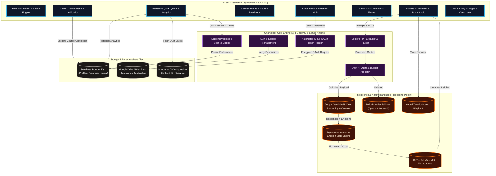
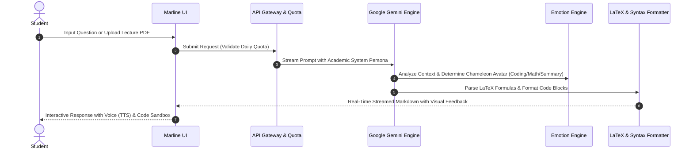

# 🎓 Chameleon FCDS — Next-Gen Academic & AI Platform

**The unified academic ecosystem, AI study companion, and interactive learning hub engineered for Faculty of Computing & Data Sciences (FCDS) students.**

[Explore Live Platform](https://chameleon-nu.vercel.app) • [Launch Marline AI](https://chameleon-nu.vercel.app/marline) • [Browse Specializations](https://chameleon-nu.vercel.app/specialization) • [GPA Calculator](https://chameleon-nu.vercel.app/calculator) • [Study Spaces](https://chameleon-nu.vercel.app/study-spaces)

---

## 🌟 Executive Overview

**Chameleon FCDS** is a modern, high-performance academic ecosystem crafted to elevate the learning journey for computer science, artificial intelligence, and data science students. 

The platform bridges university curricula with state-of-the-art web technology by integrating **adaptive generative AI assistance**, **interactive multi-mode quiz systems**, **real-time cloud lecture synchronization**, and **predictive academic modeling**—all wrapped in an immersive, cinematic UI driven by GSAP 3 animations and smooth scrolling physics.

```mermaid
flowchart TB
    %% Styling & Theme
    classDef clientLayer fill:#0f172a,stroke:#38bdf8,stroke-width:2px,color:#f8fafc;
    classDef aiEngine fill:#431407,stroke:#f97316,stroke-width:2px,color:#ffedd5;
    classDef quizEngine fill:#052e16,stroke:#22c55e,stroke-width:2px,color:#dcfce7;
    classDef coreGateway fill:#311042,stroke:#c084fc,stroke-width:2px,color:#fae8ff;
    classDef dataStore fill:#1c1917,stroke:#a8a29e,stroke-width:2px,color:#f5f5f4;

    %% Client Frontend Experience
    subgraph UI_EXPERIENCE["Client Experience Layer (Next.js & GSAP)"]
        UI_HOME["Immersive Home & Motion Engine"]
        UI_MARLINE["Marline AI Assistant & Study Studio"]
        UI_QUIZ["Interactive Quiz System & Analytics"]
        UI_TRACKS["Specializations & Course Roadmaps"]
        UI_DRIVE["Cloud Drive & Materials Hub"]
        UI_CALC["Smart GPA Simulator & Planner"]
        UI_CERT["Digital Certifications & Verification"]
        UI_SPACES["Virtual Study Lounges & Video Vault"]
    end

    %% Next.js Application Core
    subgraph CORE_GATEWAY["Chameleon Core Engine (API Gateway & Server Actions)"]
        AUTH_GUARD["Auth & Session Management"]
        RATE_LIMIT["Daily AI Quota & Budget Allocator"]
        PDF_PARSER["Lecture PDF Extractor & Parser"]
        ANALYTICS_ENG["Student Progress & Scoring Engine"]
        CRON_REFRESH["Automated Cloud OAuth Token Rotator"]
    end

    %% AI & Intelligence Services
    subgraph AI_SERVICES["Intelligence & Natural Language Processing Pipeline"]
        LLM_GEMINI[("Google Gemini API (Deep Reasoning & Context)")]
        LLM_FALLBACK[("Multi-Provider Failover (OpenAI / Anthropic)")]
        TTS_AUDIO[("Neural Text-To-Speech Playback")]
        EMOTION_ENG[("Dynamic Chameleon Emotion State Engine")]
        LATEX_RENDER[("KaTeX & LaTeX Math Formulations")]
    end

    %% Backend & Persistent Storage
    subgraph STORAGE_LAYER["Storage & Persistent Data Tier"]
        DB_SUPABASE[("Supabase PostgreSQL (Profiles, Progress, History)")]
        DRIVE_STORAGE[("Google Drive API (Slides, Summaries, Textbooks)")]
        QUIZ_BANK[("Structured JSON Question Banks (140+ Quizzes)")]
    end

    %% Interaction Links
    UI_MARLINE -->|"Prompts & PDFs"| PDF_PARSER
    PDF_PARSER -->|"Structured Context"| RATE_LIMIT
    RATE_LIMIT -->|"Optimized Payload"| LLM_GEMINI
    RATE_LIMIT -.->|"Failover"| LLM_FALLBACK
    LLM_GEMINI -->|"Responses + Emotions"| EMOTION_ENG
    EMOTION_ENG -->|"Formatted Output"| LATEX_RENDER
    LATEX_RENDER -->|"Streamed Insights"| UI_MARLINE
    UI_MARLINE -->|"Voice Narration"| TTS_AUDIO

    UI_QUIZ -->|"Quiz Answers & Timing"| ANALYTICS_ENG
    ANALYTICS_ENG -->|"Persist Performance"| DB_SUPABASE
    DB_SUPABASE -->|"Historical Analytics"| UI_QUIZ

    UI_DRIVE -->|"Folder Exploration"| CRON_REFRESH
    CRON_REFRESH -->|"Encrypted OAuth Request"| DRIVE_STORAGE

    AUTH_GUARD -->|"Verify Permissions"| DB_SUPABASE
    UI_QUIZ -->|"Fetch Quiz Levels"| QUIZ_BANK
    UI_CERT -->|"Validate Course Completion"| DB_SUPABASE

    %% Apply Classes
    class UI_HOME,UI_MARLINE,UI_QUIZ,UI_TRACKS,UI_DRIVE,UI_CALC,UI_CERT,UI_SPACES clientLayer;
    class AUTH_GUARD,RATE_LIMIT,PDF_PARSER,ANALYTICS_ENG,CRON_REFRESH coreGateway;
    class LLM_GEMINI,LLM_FALLBACK,TTS_AUDIO,EMOTION_ENG,LATEX_RENDER aiEngine;
    class DB_SUPABASE,DRIVE_STORAGE,QUIZ_BANK dataStore;
```

---

## Key Features & Capabilities

### 1. Marline AI Assistant & Study Studio
*An intelligent, multi-modal conversational companion tailored specifically for computing and data science coursework.*

```mermaid
sequenceDiagram
    autonumber
    actor Student as Student
    participant UI as Marline UI
    participant Gateway as API Gateway & Quota
    participant AI as Google Gemini Engine
    participant Emotion as Emotion Engine
    participant Render as LaTeX & Syntax Formatter

    Student->>UI: Input Question or Upload Lecture PDF
    UI->>Gateway: Submit Request (Validate Daily Quota)
    Gateway->>AI: Stream Prompt with Academic System Persona
    AI->>Emotion: Analyze Context & Determine Chameleon Avatar (Coding/Math/Summary)
    AI->>Render: Parse LaTeX Formulas & Format Code Blocks
    Render-->>UI: Real-Time Streamed Markdown with Visual Feedback
    UI-->>Student: Interactive Response with Voice (TTS) & Code Sandbox
```

- **Reactive Chameleon Personas:** Context-aware avatar expressions that dynamically adapt based on conversation context:
  - **Thinking:** When processing complex algorithmic concepts.
  - **Coding:** When formatting and debugging code snippets.
  - **Idea / Concept:** Explaining theoretical models and architectures.
  - **Reading / Summary:** Extracting insights from slides or documents.
  - **Success & Encouragement:** Celebrating solved problems.
- **Lecture PDF Extraction & Analysis:** Upload lecture slide decks and research papers to extract key takeaways, summaries, and revision questions.
- **Mathematical & Code Sandbox:** Native rendering of $\LaTeX$ / KaTeX mathematical equations and highlighted multi-language syntax with one-click copy.
- **Neural Text-to-Speech (TTS):** Audio narration of explanations for eyes-free listening and mobile revision.
- **Smart Daily Token Quotas:** Proactive rate-limiting and budget allocation ensuring sustainable and fair resource distribution.

---

### 2. Adaptive Quiz & Self-Evaluation Engine
*A comprehensive self-assessment engine designed to test conceptual understanding and exam readiness.*

- **Dual Evaluation Modes:**
  - **Instant Feedback Mode:** Immediate answers and detailed explanations upon selection for rapid knowledge reinforcement.
  - **Traditional Exam Mode:** Simulates real-world university midterm and final exam environments by concealing results until full completion.
- **Flexible Timing Configurations:** Select from speed sprints (1, 5, 15, 30, 60 minutes) or pressure-free untimed sessions.
- **140+ Curated Question Banks:** Systematically categorized across academic levels and disciplines.
- **Real-Time Performance Analytics:** Post-quiz diagnostics highlighting areas of strength, weaknesses, accuracy rates, and time allocation.

---

### 3. Academic Specializations & Curated Roadmaps
*Comprehensive academic tracks covering the full curriculum of the Faculty of Computing & Data Sciences:*

| Specialization Track | Focus & Core Disciplines |
| :--- | :--- |
| **Computing & Data Sciences** | Data structures, algorithms, database systems, software engineering, and computational theory. |
| **Artificial Intelligence** | Machine learning, deep learning, neural networks, natural language processing (NLP), and computer vision. |
| **Cyber Security** | Network security, ethical hacking, digital forensics, cryptography, and vulnerability assessment. |
| **Media Analytics** | Digital media intelligence, full-stack application development, and interactive data visualization. |
| **Business Analytics** | Enterprise business intelligence (BI), financial computing, marketing analytics, and tech entrepreneurship. |
| **Healthcare Informatics** | Clinical data systems, bioinformatics, medical imaging, and healthcare data governance. |

---

### 4. Cloud Drive Sync & Material Hub
*Direct, organized cloud integration providing instantaneous access to course materials.*

- **Departmental Hierarchy:** Clean folder organization structured by specialization, academic level, semester, and course name.
- **Zero-Downtime Token Rotation:** Automated serverless background refresh ensuring perpetual, uninterrupted file access.
- **In-Browser Document Viewer:** Direct preview of lecture slides, past exams, and textbooks without mandatory downloads.

---

### 5. Smart GPA Simulator & Academic Planner
*A specialized grade point average calculator tailored to university credit-hour bylaws.*

- **Semester & Cumulative GPA Calculation:** Precise calculations factoring in letter grades, credit hours, and historical weights.
- **"What-If" Academic Scenario Planner:** Project required future grades to achieve targeted honors levels or graduation goals.
- **Profile Plan Persistence:** Save academic trajectories directly to your student profile.

---

### 6. Verifiable Digital Certifications
- **Automated Milestone Issuance:** Instant generation of digital certificates upon finishing course modules and quiz series.
- **Unique Verification Identifiers:** Built-in verification tokens allowing employers and institutions to authenticate certificate validity online.
- **High-Fidelity Export:** Downloadable print-ready PDF and high-resolution image formats for LinkedIn and professional portfolios.

---

### 7. Study Spaces & Community Vault
- **Virtual Study Lounges:** Distraction-free virtual study environments featuring ambient soundscapes and an integrated Pomodoro focus timer.
- **Curated Video Lecture Vault:** Handpicked, structured academic video series organized by topic to eliminate irrelevant YouTube distractions.
- **Chameleon Store:** Student gear, merchandise, and academic accessories for platform members.

---

## UI/UX & Motion Engineering

The Chameleon FCDS interface is built with an uncompromising commitment to aesthetic excellence and responsiveness:

- **Cinematic Dark Mode:** Ergonomic, high-contrast dark theme engineered to minimize eye strain during extended night study sessions.
- **GSAP 3 & Lenis Physics:** Silky smooth scrolling dynamics, scroll-triggered reveals, and interactive magnetic button interactions.
- **Fluid Responsiveness:** 100% responsive architecture optimized across ultra-wide monitors, laptops, tablets, and smartphones.
- **Inclusive Accessibility:** Built on Radix UI primitives ensuring WCAG compliance, keyboard navigation, and screen reader compatibility.

---

## Technical Architecture & Stack

```mermaid
graph LR
    subgraph FRONTEND["Frontend Presentation"]
        NEXT["Next.js 14 (App Router)"]
        TS["TypeScript 5"]
        TW["Tailwind CSS"]
        SHAD["shadcn/ui + Radix UI"]
        MOTION["GSAP 3 + Lenis + Framer Motion"]
    end

    subgraph AI_PIPELINE["Intelligence Pipeline"]
        GENAI["Google Gemini Models"]
        OCR["PDF Parse & Vectorizer"]
        KATEX["KaTeX LaTeX Engine"]
    end

    subgraph BACKEND_SERVICES["Cloud & Persistence"]
        SUPA["Supabase PostgreSQL"]
        GDRIVE["Google Drive API"]
        CRON["cron-job.org Token Service"]
        RESEND["Resend Email API"]
    end

    FRONTEND <-->|"Server Actions & REST"| BACKEND_SERVICES
    FRONTEND <-->|"Streaming AI SDK"| AI_PIPELINE
    BACKEND_SERVICES <-->|"Sync & Auth Bridge"| AI_PIPELINE
```

### Component Breakdown:
- **Application Framework:** Next.js 14 (React 18, App Router, Server Components & Actions)
- **Language Standard:** TypeScript 5 with strict type checking
- **Design System:** Tailwind CSS, Radix UI Primitives, shadcn/ui
- **Physics & Animations:** GSAP 3 (ScrollTrigger), Lenis Smooth Scroll, Framer Motion
- **AI & Processing:** Google Gemini (`@google/genai`), Vercel AI SDK (`ai`), KaTeX Math Renderer, PDF.js, Mammoth
- **Database & Security:** Supabase (PostgreSQL), Custom Session Auth, Bcrypt
- **Cloud Infrastructure:** Google Cloud Platform (Drive API, OAuth 2.0), Vercel Global Edge Network

---

## Platform Impact

| Active Students | Quiz Repositories | Academic Courses | Completed Quizzes |
| :---: | :---: | :---: | :---: |
| **5,000+** | **140+** | **200+** | **30,000+** |

---

## 👥 Authors & Acknowledgments

**Chameleon FCDS** is developed and maintained with dedication to empower computing and data science students.

- **Lead Architect & Creator:** [Levi Ackerman / Abdo Ahmed](https://www.linkedin.com/in/abdoahmed/)
- **Special Thanks:** All faculty members, teaching assistants, and student contributors who helped curate, review, and structure quiz banks and lecture archives.

---

## Intellectual Property & License

**Chameleon FCDS Educational Ecosystem**.  
*Engineered with passion for excellence in computing education.*

All rights reserved © 2026. Copying, forking, modification, redistribution,
and reuse of the source code are prohibited without prior written
permission.

See the [LICENSE](LICENSE) file for the full terms.

[Visit Chameleon](https://chameleon-nu.vercel.app) • [Get in Touch / Support](https://wa.me/+201552828377)

