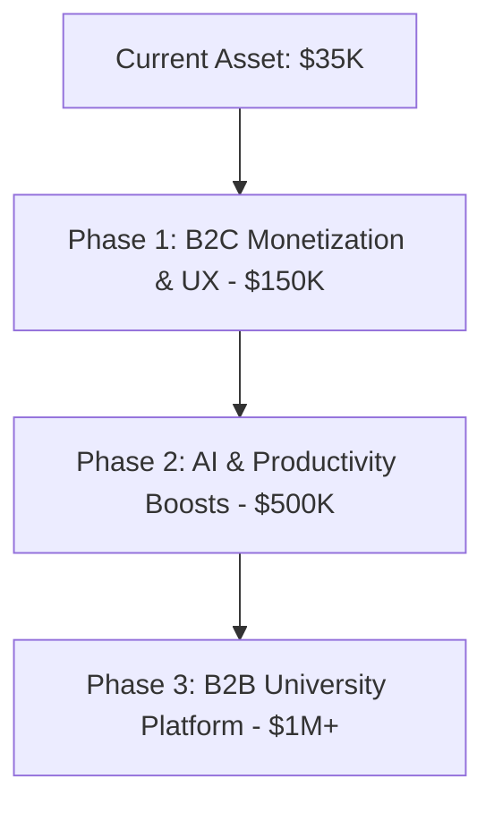

# 🦎 Chameleon FCDS: Site Valuation, Features Audit, and the $1M Growth Roadmap

This document provides a comprehensive analysis of the **Chameleon FCDS** educational platform, details its current value in today's market, and outlines the exact feature set and business models needed to scale the platform to a **$1,000,000+ valuation**.

---

## 📋 1. Executive Summary

Chameleon FCDS is a highly polished, gamified educational platform tailored specifically for Computer Science and Data Science students. Leveraging a modern tech stack (Next.js 14, Supabase, Tailwind CSS 4, and GSAP), the platform already boasts strong engagement metrics (5,000+ users, 30,000+ completed quizzes). 

By transitioning from a free academic portal to a **hybrid B2C (SaaS + Gamified Micro-transactions) and B2B (University White-labeling)** model, the platform is strategically positioned to tap into the high-growth EdTech sector.

---

## 🔍 2. Current Features Audit

The platform consists of several highly integrated subsystems that form a cohesive user experience:

### 🎯 Learning & Curriculum Management
*   **6 Core Specializations:** Specialized learning paths including:
    *   *Computing & Data Sciences* (45 courses, 2,000+ students)
    *   *Cybersecurity* (32 courses, 1,800+ students)
    *   *Artificial Intelligence* (28 courses, 2,000+ students)
    *   *Media Analytics* (52 courses, 300+ students)
    *   *Business Analytics* (24 courses, 400+ students)
    *   *Healthcare Informatics* (18 courses, 200+ students)
*   **Structured Progression:** Level-based difficulty (Level 1 and Level 2) mimicking academic progression.
*   **Interactive Curriculum Engine:** Seamless browsing of specialization routes and completion tracking.

### 🧠 Gamified Quiz & Tournament System
*   **Multiple Modes:** Traditional (results at the end) and Instant Feedback (real-time grading) modes.
*   **Flexible Timers:** Customizable quiz durations (1 min to 60 min, plus unlimited mode) with point-based incentives.
*   **Fair-Play Scoring Algorithm:** Complex formula calculating scores based on time, correctness, and difficulty.
*   **First-Attempt Rules:** Prevent score inflation by only counting the user's first quiz attempt for tournaments.
*   **Live Leaderboards:** Separation of Level 1 and Level 2 brackets, search features, and personal rank highlights.
*   **Gamified Audio UX:** Integrated Duolingo-like sound effects (correct/wrong/lesson-complete cues).

### 📁 Secure Google Drive File Integration
*   **Automatic OAuth Sync:** Seamless background token refresh system running every 30 minutes via cron jobs.
*   **Niche Folder Mapping:** Automated structure for mapping materials to department/level directories.
*   **Secure Access Tokens:** Time-limited file sharing URLs to prevent unauthorized content distribution.
*   **Integrated PDF Viewer:** In-app viewing capabilities to retain users on-site.

### 🤖 AI Study Assistant (Hugging Face / Vercel AI SDK)
*   **Document Processor:** Extract text/insights from uploaded PDFs and DOCX files.
*   **Interactive Chat Modal:** Conversational study assistant that answers questions based on class documents.

### 🧮 Chameleon Math & Scientific Suite
*   **Graphing Panel:** Visual math plotter component for plotting algebraic and statistical functions.
*   **Matrix & Math Engines:** Support for complex calculations, vector mathematics, and LaTeX rendering (`react-katex`, `remark-math`).

### 🛡️ Security & Performance UI/UX
*   **Anti-Cheat System:** Integrated DevTools protection (`DevToolsProtection.tsx`) preventing code inspection, console manipulation, and quiz answer snooping.
*   **High-End Motion Design:** Fluid GSAP micro-animations, Lenis smooth scrolling, and Framer Motion components designed for a premium feel.
*   **Administrative Panel:** Secure route protection, token refresh status monitor, and analytics dashboard.

---

## 💰 3. Current Valuation Analysis

EdTech and SaaS platforms are valued based on recurring revenue, proprietary IP (Intellectual Property), active user base (MAUs), and content depth.

### Scenario-Based Valuation Matrix

| Valuation Model | Active Metrics | Estimated Valuation | Valuation Rationale |
| :--- | :--- | :--- | :--- |
| **Pre-Revenue / Tech Asset Value** | 5,000+ Registered Users 140+ Custom Quizzes Proprietary Math & Drive Engines | **$25,000 – $45,000** | Valued purely on the replacement cost of custom engineering hours, the 140+ content assets, and user database acquisition value. |
| **B2C Premium Subscription (SaaS)** | 1,500 Monthly Active Users (MAUs) 10% conversion to Premium ($3/mo) | **$180,000 – $270,000** | Valued at a **4x - 6x ARR multiple** on ~$45,000 Annual Recurring Revenue (ARR). |
| **B2B University Licensing** | 3 Departmental Licenses ($20,000/year contract value) | **$480,000 – $600,000** | B2B contracts command higher multiples (**8x - 10x ARR**) due to lower churn and highly stable contracts. |

---

## 🚀 4. The 1 Million Dollar Growth Roadmap

To scale Chameleon FCDS to a **$1,000,000 valuation**, we must implement features that maximize **User Retention**, **Direct Monetization**, and **B2B Scalability**.

---

### 💎 Phase 1: High-Conversion B2C Monetization (UX & Gamification)

To kickstart direct revenue, we should commercialize the gamified aspects of the site.

1.  **Chameleon "Streak Safeguards" & In-App Economy:**
    *   *Feature:* Introduce a virtual currency (e.g., "Chameleon Gems") earned through quiz completion.
    *   *Monetization:* Users can purchase Gems with real money to buy **Streak Freezes**, custom avatars, or quiz hints.
    *   *Impact:* Highly effective gamification loop (pioneered by Duolingo) that boosts DAUs/MAUs.
2.  **Official Course Certifications & LinkedIn Integration:**
    *   *Feature:* Add a verification layer to the `/certifications` module. Upon passing a specialization's comprehensive exam, the user receives an official PDF certificate with a unique verification hash.
    *   *Monetization:* Charges a small fee ($10–$25) to unlock the shareable, official badge that posts directly to LinkedIn.
3.  **Ad-Free Premium Tier:**
    *   *Feature:* A "Chameleon Pro" monthly membership ($4.99/mo) that removes the `AdBanner.tsx` components and provides early access to tournament levels.

---

### ⚡ Phase 2: High-Value Productivity & AI Upgrades

These features enhance student productivity, making the site an indispensable daily utility.

1.  **AI Textbook Chat & Page Citation Engine:**
    *   *UX Improvement:* Connect the `/drive` files directly to the AI Assistant. When a student queries a topic (e.g., "How does binary search work?"), the AI not only explains it but shows a clickable link highlighting the exact page in the lecture PDF stored on Google Drive.
    *   *Productivity Boost:* Reduces study search times by 90%.
2.  **OCR Math & Code Handwriting Scanner:**
    *   *UX Improvement:* Integrate an optical character recognition (OCR) tool in the `/calculator` and `/ai` routes. Students can photograph a handwritten math formula or code block and import it instantly.
    *   *Productivity Boost:* Eliminates manual input for complex calculations.
3.  **Real-Time Peer-to-Peer Quiz Tournaments:**
    *   *UX Improvement:* Turn the tournament system into a live multiplayer game using WebSockets. Students can launch quick 1v1 challenges, betting virtual currency on who solves 5 questions faster.
    *   *Impact:* Explodes organic user acquisition via word-of-mouth.

---

### 🏢 Phase 3: The $1M Pivot - B2B Creator & University Platform

The highest valuation multiples exist in B2B enterprise software. This phase transforms Chameleon from a single website into an educational **SaaS infrastructure**.

1.  **No-Code AI Quiz & Curriculum Generator for Professors:**
    *   *Feature:* Allow professors or creators to upload a syllabus, lecture video link, or textbook PDF. The system automatically drafts:
        *   Interactive quizzes mapped to custom levels.
        *   LaTeX formula sheets.
        *   A Google Drive folder structure.
    *   *B2B Value:* Resolves the massive bottleneck of curriculum preparation for educators.
2.  **White-Labeled Department Portals (B2B SaaS):**
    *   *Feature:* License the Chameleon interface to universities or colleges (e.g., "FCDS Chameleon Portal"). The university gets dedicated student analytics, customized security/anti-cheat measures, and localized tournament leaderboards.
    *   *Enterprise Pricing:* $15,000 – $40,000 / year per institution.
3.  **Creator Course Marketplace:**
    *   *Feature:* Allow teaching assistants or top students to publish custom study guides, practice exams, and specializations on the `/store` page.
    *   *Revenue Share:* Chameleon takes a 20% commission on every transaction.

---

## 🛠️ 5. Execution Checklist

To reach these goals, focus on these engineering milestones:

- [ ] **Establish "Chameleon Gems" Economy:** Create Supabase tables for user balances, in-app purchases, and product catalogs.
- [ ] **Implement Stripe/Payment Gateway:** Set up secure checkout routes in the `/api/store/purchase` API.
- [ ] **Upgrade AI to RAG (Retrieval-Augmented Generation):** Link Google Drive PDFs to vector databases for hyper-accurate document search and citation.
- [ ] **Refine `/admin` Analytics:** Provide deep user performance metrics to show potential university buyers.
- [ ] **Launch a B2B Demo Landing Page:** Showcase the platform's features to dean offices and university administrators.
